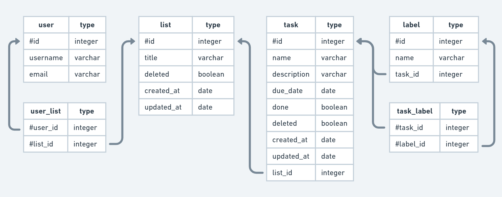

# CVWO Project: Task Management Project

Done by Marcus Pang Yu Yang

## Getting Started

Run `yarn` to install all the dependencies and `yarn dev` to start the backend and frontend instances. Backend is located at [localhost:4000](localhost:4000), and frontend is located at [localhost:3000](localhost:3000)

## Features

1. Authentication
   - [x] Users can register/login using traditional email and password through Go backend
   - [x] Validation is done on frontend and backend
   - [ ] Users can edit their email and password
2. Tasks
   - [x] Users can create/delete/update tasks
   - [x] Tasks are stored in a list
   - [x] Tasks have due dates
   - [x] Tasks have labels
   - [ ] Tasks can be dragged and dropped into other lists
   - [ ] Tasks can be seen on the calendar
3. Lists
   - [x] Users can create/delete/update lists
   - [ ] Lists can be sorted based on creation date, labels, alphabetical order
4. Calendar
   - [ ] Users can see all tasks with due dates assigned
   - [ ] Clicking on a date creates a new task
5. Miscellaneous
   - [x] Board/Table view
   - [ ] Trash bin to show recently deleted tasks
   - [ ] Users can search through tasks and lists
   - [ ] Notifications can be given based on the due date
   - [ ] Tasks can be shared/assigned to other users (edit access)
   - [ ] Lists can be shared/assigned to other users (edit access)
   - [x] Dark mode

# Tech stack

## Frontend

- React.js
- Next.js
- Redux Toolkit
- RTK Query
- Typescript
- ChakraUI

## Backend

- Golang
- gofiber
- GORM
- jwt-go
- PostgreSQL

Database Tables

## Tutorials/UI Frameworks

- https://www.youtube.com/watch?v=X9WULjvgqTY&list=PLlameCF3cMEvoymqJrVrvwx5VLLpjin8r (gofiber tutorial)
- https://chakra-templates.dev/ (ChakraUI templates)
- https://choc-ui.tech/ (ChakraUI templates)
